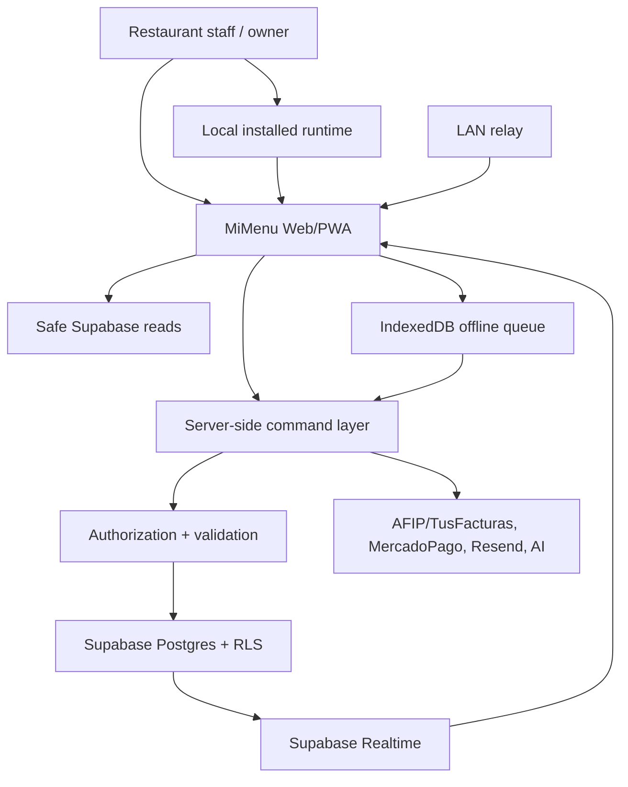

# MiMenu Product Platform Plan

## North Star

MiMenu should become a premium restaurant operating platform: reliable enough for daily restaurant service, structured enough for local installation, structured enough for online synchronization, and clear enough for support and onboarding.

The chosen product direction is:

- Fudo-like ease of access and low hardware friction.
- Toast-like resilience during internet, LAN, or cloud disruption.
- Local-first operations with cloud synchronization.
- Argentina-first fiscal/payment reality.
- Designed from the start for 1000+ daily active users.

The target is not "a POS screen". The target is a full operating system for restaurants:

- POS and tables
- Kitchen operations
- Caja and shifts
- Fiscal invoicing
- Payments
- Stock
- CRM and reservations
- Delivery
- Analytics
- Multi-branch management
- Offline continuity
- Local computers and kitchen/production monitors
- Support and observability

## Current Architecture Summary

MiMenu currently uses:

- React/Vite SPA
- Supabase client from the browser
- Supabase Auth/Postgres/RLS/Realtime
- Supabase Edge Functions for selected integrations
- Netlify deployment
- IndexedDB offline queue
- Local WebSocket relay for LAN notifications

This is a strong prototype-to-product base, but critical operations are not consistently centralized server-side.

## Target Architecture

## Local Installation Direction

MiMenu should be evaluated as a hybrid local + online product:

- local app/runtime on restaurant computers;
- kitchen/production monitor mode;
- local offline storage;
- local queue of business operations;
- cloud synchronization when internet returns;
- remote support and updates through a controlled release channel.

Technology is not locked yet. Candidate directions include:

- PWA installed in browser;
- Electron/Tauri desktop wrapper;
- local service/agent for printers, LAN, kitchen monitors, and sync support;
- Cloudflare/Supabase-backed online layer.

The decision must be made after evaluating packaging, auto-update, printer/device access, offline reliability, support cost, and security.

## Responsibility Boundaries

### Frontend

- Display data
- Capture user intent
- Provide fast UX
- Manage local/offline state
- Show actionable errors
- Never own fiscal, payment, or authorization decisions

### Server-side command layer

- Validate requests
- Authorize actor and tenant
- Execute business transactions
- Call external providers
- Enforce idempotency
- Write audit/events
- Return stable operation states

### Database

- Enforce RLS
- Preserve transactional integrity
- Store immutable business records where needed
- Provide safe RPCs with explicit auth checks

## Critical Commands To Move/Standardize

- `open_shift`
- `close_shift`
- `append_cash_withdrawal`
- `open_table`
- `add_turn_item`
- `send_to_kitchen`
- `close_table`
- `create_payment_intent`
- `poll_payment_status`
- `issue_invoice`
- `retry_invoice`
- `send_receipt`
- `invite_member`
- `verify_staff_pin`
- `register_stock_ingreso`
- `register_stock_egreso`
- `sync_offline_operation`

## Offline Charging And Table Close

The target product should support charging and closing a table offline when the payment method can be handled locally, such as cash or manually recorded card/transfer.

Provider-dependent operations need explicit states:

- MercadoPago terminal payment cannot be assumed successful offline.
- AFIP/ARCA fiscal issuance cannot be completed offline unless a legal contingency flow is defined.
- The local close must create a durable pending operation.
- Sync must reconcile without duplicating table closes, stock movements, caja totals, or fiscal records.

## Operation-Based Synchronization

MiMenu must not synchronize isolated UI updates as if they were the business truth.

The target model is operation-based synchronization:

- A business action creates one complete operation.
- The operation contains all data needed to apply the business effect.
- The operation is stored locally before the UI confirms success.
- The operation is applied locally for offline continuity.
- The operation is later submitted to the server.
- The server processes it idempotently.
- Derived effects are created in one controlled path.

Example: `CLOSE_TABLE` is not only a `turns.status = cerrada` update. It is a complete business operation containing:

- restaurant and branch scope;
- device id and operation id;
- turn/table/caja identifiers;
- item snapshot;
- payment details;
- totals, discounts, tips, and method;
- staff/mozo attribution;
- stock impacts or recipe snapshot;
- fiscal intent or pending fiscal state;
- local timestamps;
- sync status and retry metadata.

When synchronized, that operation must distribute its effects to:

- table/turn state;
- caja totals;
- stock movements;
- audit logs;
- fiscal records or contingency records;
- reports and analytics;
- realtime/device updates.

No part of this should be silently overwritten or duplicated. If the server cannot apply the operation cleanly, it must produce a conflict or failed-sync state that can be reviewed.

The first formal contract is documented in `docs/architecture/close-table-operation.md`.

## Environments

Required environments:

- `local`: developer environment
- `staging`: realistic test environment with separate Supabase project
- `production`: real customers only

Every environment needs separate:

- Supabase project or isolated database
- Edge/Worker secrets
- deployment target
- Sentry environment
- provider sandbox/production credentials

## Platform Choices

Recommended short-term:

- Keep Supabase for Auth/Postgres/RLS/Realtime.
- Keep current frontend until foundation is secure.
- Add or strengthen server-side functions for sensitive operations.
- Consider Cloudflare Pages or Workers Static Assets for frontend after foundation.

Recommended medium-term:

- Standardize API layer on either Supabase Edge Functions or Cloudflare Workers.
- Use Cloudflare for DNS, WAF, caching, and possibly Workers-based integrations.
- Build internal support/admin tooling.

## Architecture Quality Bar

A feature is platform-grade only when:

- It has clear ownership boundaries.
- It validates and authorizes every critical operation.
- It handles retries without duplicate side effects.
- It can be monitored.
- It has tests or a documented verification path.
- It fails safely.

## Scale Target: 1000+ Daily Active Users

MiMenu must be designed for peak restaurant hours, not average traffic.

Assumptions:

- Many restaurants may operate at the same lunch/dinner windows.
- A single restaurant may have multiple devices: caja, salon tablets, kitchen display, owner dashboard, delivery screen.
- Offline queues may reconnect in bursts after ISP outages.
- Realtime subscriptions can multiply quickly if every screen opens broad channels.
- Edge/API endpoints must tolerate retries and duplicate submissions.

Design requirements:

- All critical operations must be idempotent.
- Sync must use batching and backoff.
- Realtime channels must be branch-scoped, not global.
- Database indexes must match hot queries.
- Long-running provider calls should not block local restaurant operation.
- Reporting queries should not overload transactional paths.
- Observability must identify restaurant, branch, device, operation id, and release version.
- Staging load/smoke tests should simulate peak service, not just one happy path.

This does not mean premature microservices. It means disciplined boundaries, safe data flow, and avoiding designs that collapse under normal restaurant concurrency.
